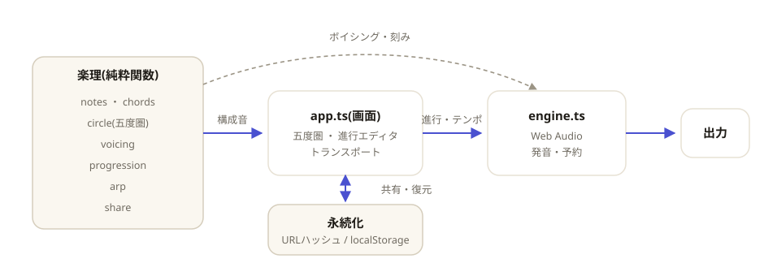

# wasei

[](https://github.com/miruky/wasei/actions/workflows/ci.yml)
[](https://github.com/miruky/wasei/actions/workflows/deploy.yml)

[](LICENSE)

**コード進行を組み立てて鳴らし、五度圏でその位置と機能を確かめるブラウザ内プレイグラウンド。**

公開ページ: https://miruky.github.io/wasei/

## 概要

waseiは、和音を並べてコード進行を作り、ブラウザだけで再生しながら五度圏で全体像を見るためのツールである。中央の五度圏には12の長調が外周に、その平行短調が内周に並ぶ。選んだキーのダイアトニックコード（I・IV・Vの長三和音とii・iii・viの短三和音）が隣り合う区画として浮かび上がるので、進行が調のどこを通っているかが一目で分かる。区画をクリックすればその和音が進行の末尾に加わり、すぐ音が鳴る。

進行はコマ（スロット）の列で、各コマに和音の種類（メジャー、マイナー、7th、sus、dim、テンションなど18種）と拍数を指定できる。再生は和音を伸ばすパッドと、構成音を順に鳴らすアルペジオの2通りで、テンポは40から240の範囲で変えられる。各コマには現在のキーから見たローマ数字（V7やviなど、調から外れた和音は♭VIIのように）が添えられ、機能を確かめながら組める。

作った進行はURLのハッシュに丸ごと入る。リンクをコピーして共有すれば、開いた相手の画面に同じ進行が復元される。最後に編集した進行はこの端末のブラウザにも保存され、次に開いたときに戻る。サーバーへは何も送らない。

発音はWeb Audioを使うため、ブラウザの仕様上、最初にどこかを操作するまでは音が出ない。

### なぜ作ったのか

五度圏は「隣り合う調は調号が1つ違う」「ダイアトニックコードは輪の上で固まる」という和声の地理を1枚に畳んだ図だが、紙の上では静止していて、進行と結びつけて読むには慣れがいる。コードを置くと五度圏のどこが光り、それがどう聞こえるかを同時に見せれば、図と音と理屈が一度に結びつく。インストール不要で開いてすぐ触れ、作った進行をリンクで渡せる、学習と試作のための場が欲しかった。和音やスケールの計算は標準的な音楽理論をそのまま実装し、発音はWeb Audioの素のノードに任せて、組み立てと可視化に集中している。

## アーキテクチャ



音名・和音・五度圏・ボイシング・進行・共有といった楽理は、DOMにもWeb Audioにも触れない純粋関数として`src/lib`に置く。画面（`app.ts`）はこれらを使って五度圏と進行エディタとトランスポートを描き、状態である進行オブジェクトを発音エンジン（`engine.ts`）へ渡す。エンジンは進行をテンポに沿って秒単位の時刻へ並べ、各和音をオシレータとゲインの組で鳴らす。進行はURLハッシュとlocalStorageへ保存し、起動時に復元する。純粋関数に切り出したことで、和声の規則も再生のスケジュールもブラウザなしでテストできる。

## 技術スタック

| カテゴリ             | 技術                          |
| :------------------- | :---------------------------- |
| 言語                 | TypeScript 5（strict）        |
| 音声                 | Web Audio API                 |
| ビルド               | Vite 6                        |
| テスト               | Vitest（happy-domでDOMも検証）|
| リンタ・フォーマッタ | ESLint 9 / Prettier           |
| CI / 配信            | GitHub Actions / GitHub Pages |
| 永続化               | URLハッシュ / localStorage    |

## 使い方

### 進行を組み立てる

和音を加える方法は2つある。

- **五度圏から** — 外周の区画は長三和音、内周は短三和音。クリックするとその和音が進行の末尾に加わる。「7thを使う」を押している間は、外周はメジャー7th、内周はマイナー7thとして加わる。
- **ダイアトニックから** — 右のパネルには現在のキーの7和音がローマ数字つきで並ぶ。こちらは機能（V7やviiø7など）に合った正しい種類で加わる。

加えたコマは下の進行ストリップに並ぶ。各コマでは種類を選び直し、拍数を1から8まで増減でき、前後への移動と削除ができる。コマをクリックするとその和音だけを試聴する。

### 再生する

トランスポートの再生ボタン、またはスペースキーで再生と停止を切り替える。

| 操作         | 内容                                               |
| :----------- | :------------------------------------------------- |
| 発音         | 和音（パッド）とアルペジオを切り替える             |
| テンポ       | 40〜240 BPM                                         |
| ループ       | 進行の終端で先頭へ戻り、切れ目なく繰り返す         |
| 移調         | 半音単位で進行全体を上げ下げする（調も一緒に動く） |
| プリセット   | 王道進行・小室進行・ツーファイブ・カノン・ブルースなど |
| ランダム生成 | 現在のキーのダイアトニックから4和音を組む          |

再生中は、鳴っているコマと五度圏の対応する区画が光る。

### キーと調

キーの主音と旋法（メジャー／マイナー）を選ぶと、五度圏のダイアトニックの強調、ローマ数字、コード名の表記（シャープ寄り／フラット寄り）がすべて追従する。たとえばCメジャーでは外周のC・F・Gと内周のDm・Em・Amが光り、Gの和音は`V`、Amは`vi`と表示される。

### 共有と保存

「リンクをコピー」を押すと、進行を載せたURLがクリップボードに入る。たとえば王道進行は次のように畳まれる。

```
https://miruky.github.io/wasei/#p=1|0|M|100|0-maj-4,7-maj-4,9-min-4,5-maj-4
```

このリンクを開くと同じ進行が復元される。明示的に保存しなくても、最後の状態はブラウザに残る。

## プロジェクト構成

- `index.html` — エントリポイント
- `src/main.ts` — 起動。`#app`へ画面を取り付ける
- `src/app.ts` — 五度圏・進行エディタ・トランスポートの画面と状態管理
- `src/icons.ts` — 線画のSVGアイコン
- `src/style.css` — デザイントークンとスタイル（ライト・ダーク対応）
- `src/lib/notes.ts` — 音名・ピッチクラス・周波数の変換
- `src/lib/chords.ts` — コードの種類の定義、構成音とシンボルの導出
- `src/lib/circle.ts` — 五度圏、ダイアトニックコード、ローマ数字解析
- `src/lib/voicing.ts` — 構成音を実音へ展開し、跳躍を抑える
- `src/lib/progression.ts` — 進行のモデル、編集、再生スケジュール、プリセット
- `src/lib/arp.ts` — アルペジオの時刻計算
- `src/lib/share.ts` — 進行とURL文字列の相互変換
- `src/lib/storage.ts` — localStorageの薄いラッパ
- `src/lib/engine.ts` — Web Audioによる発音
- `docs/architecture.svg` — 構成図
- `.github/workflows/` — CI（lint・テスト・ビルド）とPagesデプロイ

## はじめ方

### 前提条件

- Node.js 22以上

### セットアップ

```bash
git clone https://github.com/miruky/wasei.git
cd wasei
npm install
npm run dev
```

### テストの実行

```bash
npm test
```

### Lintの実行

```bash
npm run lint
```

### ビルド

```bash
npm run build
```

GitHub Pagesではリポジトリ名のサブパスで配信されるため、デプロイ時は環境変数 `WASEI_BASE=/wasei/` でViteの `base` を切り替える（`.github/workflows/deploy.yml` 参照）。

## 設計方針

- **楽理と発音を分ける** — 音名・和音・五度圏・ボイシング・進行・共有はすべて純粋関数にまとめ、AudioContextに触れるのは`engine.ts`だけにする。和声の規則も再生スケジュールもブラウザなしでテストでき、五度圏の強調と発音は同じ計算から導かれる。
- **データから図を導く** — 五度圏の並びもダイアトニックの強調も、ピッチクラスの計算で求める。位置や色を手で並べず、調を変えれば図が追従する。
- **状態は1つの進行オブジェクト** — 編集も再生も共有も保存も、単一の進行を作り直して差し替えるだけで扱う。URLとlocalStorageはその文字列表現を持つ。
- **壊れた入力を黙って捨てる** — 共有URLは厳密に検証し、未知の和音や範囲外の値が混じれば復元せず既定へ戻す。発音できない環境でも画面は動く。
- **動きは意味のある範囲で** — 五度圏の入場、再生中の区画の脈動、コマの登場にだけモーションを与え、`prefers-reduced-motion` で無効化する。

## ライセンス

[MIT](LICENSE)
